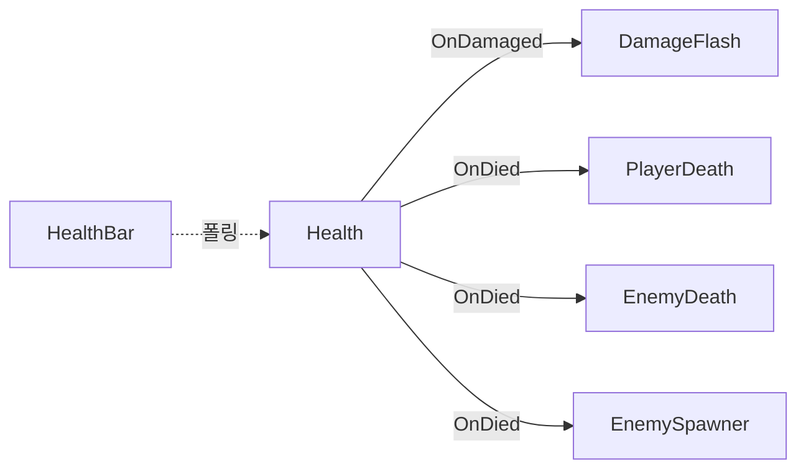

# GameBaseByClaude

## 프로젝트 소개

GameBaseByClaude는 Unity 프로젝트를 [Claude Code](https://claude.com/claude-code)와 함께 단계적으로 구축하며, AI에게 구현을 위임하면서도 아키텍처와 복잡도에 대한 통제권은 개발자가 유지하는 개발 방식을 실험한 프로젝트다. 완성된 게임이나 범용 RPG Framework가 목적이 아니라, 이동 → 전투 → 성장 → 반복 전투로 이어지는 최소 RPG 루프 하나를 구현하는 데 집중했다.

개발은 다음 사이클을 반복하며 진행되었다.

1. 요구사항 정의
2. 기존 코드 분석
3. 구조와 트레이드오프 검토
4. 최소 구현
5. 플레이 테스트
6. 필요한 부분만 수정

구현은 이 사이클의 한 단계일 뿐, 설계 결정은 매번 사람이 확인한 뒤에만 진행되었다.

## 개발 방식

[CLAUDE.md](./CLAUDE.md)에 정의된 원칙이 개발 전반에 적용되었다. 핵심만 요약하면:

- 가장 단순하게 동작하는 구현부터 시작하고, 실제 중복이나 결합 문제가 생기기 전에는 추상화하지 않는다
- Interface, Base Class, Manager, DI 같은 구조를 필요성 없이 미리 도입하지 않는다
- 한 번에 하나의 기능만 구현하고 Unity Editor에서 직접 플레이 테스트로 확인한다
- AI가 제안한 구조와 수정도 실제 문제 해결에 필요한지 검토한 뒤에만 적용한다

상세 규칙은 CLAUDE.md에 있으므로 여기서 반복하지 않는다.

## Gameplay Loop

```
Player 이동
  → Enemy 자동 생성
  → 탐색 및 추적
  → Player / Enemy 전투
  → HP 감소 및 피격 피드백
  → Enemy 사망
  → 경험치 획득
  → Level Up
  → 공격력 증가 + HP 회복
  → Enemy 재생성
  → 반복
```

Player와 Enemy의 HP는 머리 위 HP Bar와 화면의 Debug UI로 실시간 확인할 수 있다.

## Architecture

캐릭터마다 역할이 분리된 여러 개의 작은 컴포넌트를 조합하는 구조다. 상속이나 공용 베이스 클래스 없이, Player와 Enemy가 필요한 컴포넌트만 각자 가진다.

**Player**

| 컴포넌트 | 책임 |
|---|---|
| `PlayerMovement` | Input System 기반 이동 |
| `PlayerAttack` | 공격 입력 판정, 공격력 보유 |
| `PlayerDeath` | 사망 시 이동/공격/입력 비활성화 |
| `PlayerProgression` | 레벨/경험치 관리, 레벨업 시 공격력 증가와 HP 회복 지시 |
| `Health` | HP 저장/피격 판정 (공용) |
| `DamageFlash` | 피격 시각 효과 (공용) |
| `HealthBar` | HP 시각화 (공용) |

**Enemy**

| 컴포넌트 | 책임 |
|---|---|
| `EnemyPlayerReference` | Player 참조를 한 번만 찾아서 보관 |
| `EnemyMovement` | Player 탐색/추적/정지 |
| `EnemyAttack` | 사거리 기반 자동 공격 |
| `EnemyDeath` | 사망 시 경험치 지급 후 제거 |
| `Health` / `DamageFlash` / `HealthBar` | Player와 공용 |

**Spawner**: `EnemySpawner`가 살아있는 Enemy 수를 유지
**UI**: `PlayerDebugUI`, `HealthBar`

컴포넌트 간 결합은 대부분 `Health`가 발행하는 이벤트를 통해 이루어진다. `Health`는 누가 자신을 구독하는지, Player인지 Enemy인지 전혀 알지 못한다.



모든 상태 전달 방식을 하나의 패턴으로 통일하지 않고, 각 기능의 규모에 맞는 가장 단순한 방식을 선택했다. `DamageFlash`는 `Health.OnDamaged` 이벤트로 반응하지만, `HealthBar`는 같은 `Health`를 이벤트 대신 폴링으로 읽는다. 소비자가 하나뿐이고 매 프레임 값을 그대로 보여주기만 하면 되는 경우까지 이벤트를 강제하지 않았다.

## 필요에 따라 발전한 구조

처음부터 전체 아키텍처를 설계하지 않았다. 기능 요구가 생길 때마다 그 요구를 해결하는 데 필요한 구조만 추가되었다.

- Player 이동 필요 → `PlayerMovement`
- 전투 필요 → `PlayerAttack`, Enemy 전용 `Health`
- 피격을 눈으로 확인할 필요 → `Health.OnDamaged` + `DamageFlash`
- **Enemy를 Prefab으로 만들어 여러 마리 배치할 필요** → Prefab은 Scene의 Player를 직접 참조할 수 없다는 제약 때문에 `EnemyPlayerReference`로 참조 방식을 통합
- **Player도 HP가 필요해짐** → `Health`를 Enemy 전용에서 Player/Enemy 공용으로 추출하고, 사망 반응만 `PlayerDeath`/`EnemyDeath`로 분리
- 성장 요소 필요 → `PlayerProgression`
- 반복 전투 테스트 필요 → `EnemySpawner`
- 상태 확인 어려움 → `PlayerDebugUI`, `HealthBar`

처음부터 추상화한 것이 아니라, 두 번째 실제 요구가 생겼을 때만 구조를 바꿨다.

## AI 제안을 검증한 사례

AI의 제안과 구현도 플레이 테스트와 코드 리뷰를 거쳐 검증했다.

**Enemy의 비정상적인 하강**
- 문제: 정지 상태에서도 Enemy가 조금씩 아래로 이동
- 검토: `EnemyMovement`의 velocity 처리에는 문제가 없었고, 코드에서 `gravityScale`을 강제로 0으로 만드는 방법도 검토했다
- 결정: 실제 원인이 Enemy Prefab의 `Rigidbody2D` Gravity Scale 설정임을 확인하고, 코드로 Inspector 설정 문제를 숨기지 않고 Prefab을 수정했다

**Player 사망 후에도 공격 가능**
- 문제: `PlayerAttack`을 `disabled` 처리했는데도 공격이 발생
- 원인: `PlayerInput`이 활성화된 상태에서 Send Messages 입력 경로를 통해 `OnAttack` 호출이 계속 발생하는 것을 확인
- 결정: `PlayerAttack`/`Health`에 `IsDead` 같은 중복 상태를 추가하지 않고, `PlayerDeath`에서 `PlayerInput` 자체를 비활성화했다

**HealthBar 초기화 순서**
- 문제: `HealthBar.Awake()`에서 `Health.CurrentHp`를 읽으면 `Health.Awake()` 실행 순서에 의존할 가능성이 있었다
- 결정: `Awake()`에서는 참조와 자체 상태만 초기화하고, 실제 HP 값은 `Update()`에서 읽도록 수정했다

## 의도적으로 도입하지 않은 구조

다음 구조들은 나쁜 구조라서 배제한 것이 아니라, 현재 프로젝트의 규모와 요구사항에서는 도입 비용이 이점보다 크다고 판단해 만들지 않았다.

| 도입하지 않은 구조 | 판단 |
|---|---|
| `CharacterBase` | Player/Enemy 공통 동작이 아직 상속을 정당화하지 않음 |
| `IDamageable` / `IHealth` | 현재는 `Health` 하나로 충분 |
| `CombatManager` / `UIManager` | 로직이 각 컴포넌트에 자연스럽게 분산되어 총괄할 대상이 없음 |
| Event Bus | 소비자가 정해진 지역적인 `Health` 이벤트로 충분 |
| DI / Service Locator | 의존성 대부분이 sibling이거나 `Awake` 시점 1회 해결로 충분 |
| 범용 RPG Framework | 이 프로젝트가 검증하려는 것은 프레임워크가 아니라 개발 방식 자체 |

이 판단은 기능이 추가될 때마다 다시 검토되었다. `Health`가 Enemy 전용에서 공용으로 확장된 것처럼, "필요해지기 전까지는 만들지 않는다"는 원칙은 고정된 규칙이 아니라 매번 재평가되는 기준이었다.

## 기술 스택

- Unity 6000.3.23f1
- C#
- Universal Render Pipeline (URP)
- Unity Input System
- TextMeshPro
- 2D (Sprite, Rigidbody2D, Physics2D)

## 프로젝트 구조

```
Assets/
├── Scenes/
│   └── SampleScene.unity
├── Scripts/
│   ├── Camera/
│   │   └── CameraFollow.cs
│   ├── Combat/
│   │   ├── DamageFlash.cs
│   │   └── Health.cs
│   ├── Enemy/
│   │   ├── EnemyAttack.cs
│   │   ├── EnemyDeath.cs
│   │   ├── EnemyMovement.cs
│   │   ├── EnemyPlayerReference.cs
│   │   └── EnemySpawner.cs
│   ├── Player/
│   │   ├── PlayerAttack.cs
│   │   ├── PlayerDeath.cs
│   │   ├── PlayerMovement.cs
│   │   └── PlayerProgression.cs
│   └── UI/
│       ├── HealthBar.cs
│       └── PlayerDebugUI.cs
└── Resources/
    └── Prefabs/
        └── Enemy.prefab
```

## 실행 방법

1. Repository를 Clone한다
2. Unity Hub에서 프로젝트를 연다 (Unity **6000.3.23f1** 필요)
3. `Assets/Scenes/SampleScene.unity`를 연다
4. Play 버튼을 누른다

WASD 또는 방향키로 이동하고, 마우스 좌클릭(또는 Enter)으로 공격한다.

## 프로젝트에서 얻은 결론

AI 코딩 도구는 구현 속도를 확실히 높여준다. 하지만 지금 어떤 구조가 필요한지 판단하고, 프로젝트 복잡도를 통제하며, 런타임 문제의 실제 원인을 찾는 역할은 여전히 중요했다.

이 프로젝트에서 실험한 핵심은 AI가 더 많은 코드를 작성하게 만드는 것이 아니라, **필요한 코드만 작성하도록 통제하는 것**이었다.
